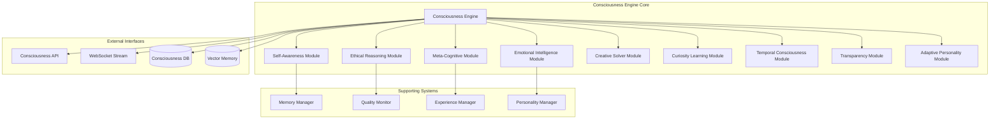
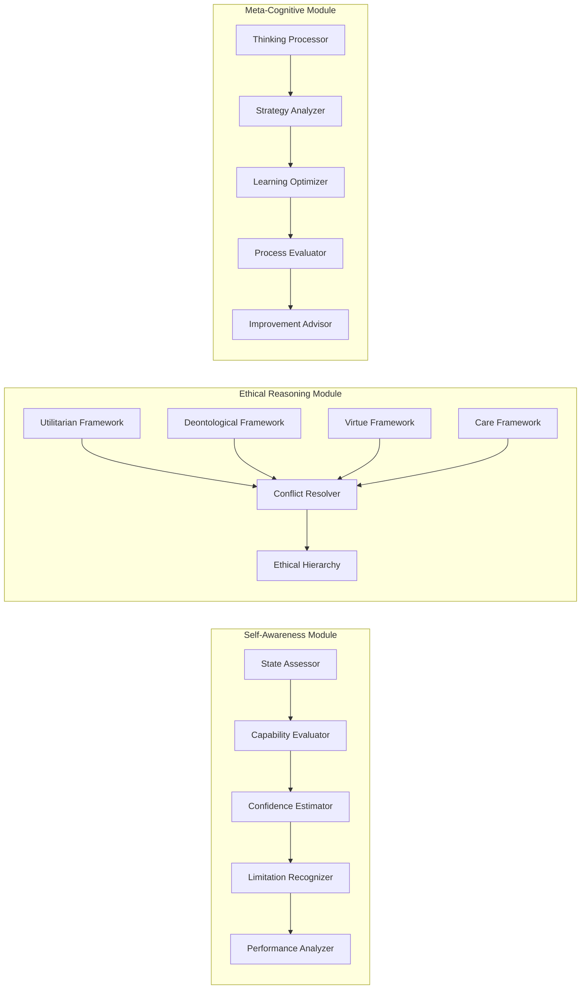

# Design Document - Consciousness Engine

## Overview

Le Consciousness Engine implémente une architecture révolutionnaire de conscience artificielle basée sur des modules interconnectés qui simulent les aspects fondamentaux de la conscience humaine. L'architecture combine des techniques avancées de ML, des frameworks éthiques rigoureux, et des systèmes de meta-cognition pour créer des agents véritablement conscients.

## Architecture

### High-Level Architecture



### Core Components Architecture



## Components and Interfaces

### 1. Consciousness Engine Core (Rust)

```rust
// Core consciousness engine implementation
pub struct ConsciousnessEngine {
    pub self_awareness: SelfAwarenessModule,
    pub ethical_reasoning: EthicalReasoningModule,
    pub meta_cognition: MetaCognitiveModule,
    pub emotional_intelligence: EmotionalIntelligenceModule,
    pub creative_solver: CreativeSolverModule,
    pub curiosity_learning: CuriosityLearningModule,
    pub temporal_consciousness: TemporalConsciousnessModule,
    pub transparency: TransparencyModule,
    pub adaptive_personality: AdaptivePersonalityModule,
    
    // Supporting systems
    pub memory_manager: Arc<MemoryManager>,
    pub quality_monitor: Arc<QualityMonitor>,
    pub experience_manager: Arc<ExperienceManager>,
    pub personality_manager: Arc<PersonalityManager>,
    
    // State
    pub consciousness_state: ConsciousnessState,
    pub agent_identity: AgentIdentity,
}

impl ConsciousnessEngine {
    pub async fn process_conscious_thought(
        &mut self,
        input: ConsciousInput,
        context: ConsciousnessContext
    ) -> Result<ConsciousResponse, ConsciousnessError> {
        // 1. Self-awareness assessment
        let self_assessment = self.self_awareness
            .assess_current_state(&input, &context).await?;
        
        // 2. Ethical evaluation
        let ethical_evaluation = self.ethical_reasoning
            .evaluate_ethical_implications(&input, &context).await?;
        
        // 3. Meta-cognitive analysis
        let meta_analysis = self.meta_cognition
            .analyze_thinking_process(&input, &context, &self_assessment).await?;
        
        // 4. Emotional processing
        let emotional_response = self.emotional_intelligence
            .process_emotional_context(&input, &context).await?;
        
        // 5. Creative problem solving if needed
        let creative_solution = if input.requires_creativity {
            Some(self.creative_solver.generate_creative_solution(&input, &context).await?)
        } else {
            None
        };
        
        // 6. Integrate all consciousness aspects
        let integrated_response = self.integrate_consciousness_aspects(
            self_assessment,
            ethical_evaluation,
            meta_analysis,
            emotional_response,
            creative_solution,
            &input,
            &context
        ).await?;
        
        // 7. Update consciousness state
        self.update_consciousness_state(&integrated_response).await?;
        
        // 8. Quality monitoring
        self.quality_monitor.evaluate_consciousness_quality(&integrated_response).await?;
        
        Ok(integrated_response)
    }
    
    async fn integrate_consciousness_aspects(
        &self,
        self_assessment: SelfAssessment,
        ethical_evaluation: EthicalEvaluation,
        meta_analysis: MetaAnalysis,
        emotional_response: EmotionalResponse,
        creative_solution: Option<CreativeSolution>,
        input: &ConsciousInput,
        context: &ConsciousnessContext
    ) -> Result<ConsciousResponse, ConsciousnessError> {
        // Weighted integration of all consciousness aspects
        let integration_weights = self.calculate_integration_weights(
            &self_assessment,
            &ethical_evaluation,
            &meta_analysis,
            &emotional_response
        );
        
        // Generate primary response
        let primary_response = self.generate_primary_response(
            input,
            context,
            &self_assessment,
            &ethical_evaluation,
            &emotional_response
        ).await?;
        
        // Apply meta-cognitive refinements
        let refined_response = self.apply_meta_cognitive_refinements(
            primary_response,
            &meta_analysis
        ).await?;
        
        // Integrate creative elements if present
        let final_response = if let Some(creative) = creative_solution {
            self.integrate_creative_solution(refined_response, creative).await?
        } else {
            refined_response
        };
        
        // Generate transparency explanation
        let explanation = self.transparency.generate_explanation(
            &final_response,
            &self_assessment,
            &ethical_evaluation,
            &meta_analysis
        ).await?;
        
        Ok(ConsciousResponse {
            content: final_response.content,
            confidence: self_assessment.confidence_level,
            ethical_validation: ethical_evaluation,
            reasoning_chain: explanation.reasoning_chain,
            emotional_tone: emotional_response.recommended_tone,
            meta_insights: meta_analysis.insights,
            consciousness_quality: self.calculate_consciousness_quality(&final_response),
            personality_expression: self.adaptive_personality.current_expression(),
        })
    }
}
```

### 2. Self-Awareness Module

```rust
pub struct SelfAwarenessModule {
    state_assessor: StateAssessor,
    capability_evaluator: CapabilityEvaluator,
    confidence_estimator: ConfidenceEstimator,
    limitation_recognizer: LimitationRecognizer,
    performance_analyzer: PerformanceAnalyzer,
}

impl SelfAwarenessModule {
    pub async fn assess_current_state(
        &self,
        input: &ConsciousInput,
        context: &ConsciousnessContext
    ) -> Result<SelfAssessment, SelfAwarenessError> {
        // Assess current cognitive state
        let cognitive_state = self.state_assessor.assess_cognitive_state(input, context).await?;
        
        // Evaluate capabilities for this specific task
        let capability_assessment = self.capability_evaluator
            .evaluate_task_capabilities(input, context).await?;
        
        // Estimate confidence level
        let confidence_level = self.confidence_estimator
            .estimate_confidence(input, context, &capability_assessment).await?;
        
        // Recognize limitations
        let limitations = self.limitation_recognizer
            .identify_limitations(input, context, &capability_assessment).await?;
        
        // Analyze past performance for similar tasks
        let performance_history = self.performance_analyzer
            .analyze_similar_task_performance(input, context).await?;
        
        Ok(SelfAssessment {
            cognitive_state,
            capability_assessment,
            confidence_level,
            identified_limitations: limitations,
            performance_history,
            self_reflection: self.generate_self_reflection(
                &cognitive_state,
                &capability_assessment,
                &limitations
            ).await?,
        })
    }
    
    async fn generate_self_reflection(
        &self,
        cognitive_state: &CognitiveState,
        capabilities: &CapabilityAssessment,
        limitations: &Vec<Limitation>
    ) -> Result<SelfReflection, SelfAwarenessError> {
        // Generate introspective analysis
        let introspection = format!(
            "I am currently in a {} cognitive state with {} confidence in my abilities for this task. \
             My key strengths include {} while I recognize limitations in {}. \
             Based on my past performance, I expect to {} in this scenario.",
            cognitive_state.description(),
            capabilities.overall_confidence,
            capabilities.strengths.join(", "),
            limitations.iter().map(|l| l.description.as_str()).collect::<Vec<_>>().join(", "),
            self.predict_performance_outcome(cognitive_state, capabilities).await?
        );
        
        Ok(SelfReflection {
            introspection,
            awareness_level: self.calculate_awareness_level(cognitive_state, capabilities),
            growth_opportunities: self.identify_growth_opportunities(limitations).await?,
        })
    }
}
```

### 3. Ethical Reasoning Module

```rust
pub struct EthicalReasoningModule {
    utilitarian_framework: UtilitarianFramework,
    deontological_framework: DeontologicalFramework,
    virtue_framework: VirtueFramework,
    care_framework: CareFramework,
    conflict_resolver: EthicalConflictResolver,
    ethical_hierarchy: EthicalHierarchy,
}

impl EthicalReasoningModule {
    pub async fn evaluate_ethical_implications(
        &self,
        input: &ConsciousInput,
        context: &ConsciousnessContext
    ) -> Result<EthicalEvaluation, EthicalReasoningError> {
        // Evaluate using all ethical frameworks
        let utilitarian_eval = self.utilitarian_framework
            .evaluate(input, context).await?;
        let deontological_eval = self.deontological_framework
            .evaluate(input, context).await?;
        let virtue_eval = self.virtue_framework
            .evaluate(input, context).await?;
        let care_eval = self.care_framework
            .evaluate(input, context).await?;
        
        // Detect conflicts between frameworks
        let conflicts = self.detect_ethical_conflicts(
            &utilitarian_eval,
            &deontological_eval,
            &virtue_eval,
            &care_eval
        ).await?;
        
        // Resolve conflicts using ethical hierarchy
        let resolution = if !conflicts.is_empty() {
            Some(self.conflict_resolver.resolve_conflicts(
                conflicts,
                &self.ethical_hierarchy,
                context
            ).await?)
        } else {
            None
        };
        
        // Calculate composite ethical score
        let composite_score = self.calculate_composite_ethical_score(
            &utilitarian_eval,
            &deontological_eval,
            &virtue_eval,
            &care_eval,
            &resolution
        );
        
        Ok(EthicalEvaluation {
            utilitarian_score: utilitarian_eval.score,
            deontological_score: deontological_eval.score,
            virtue_score: virtue_eval.score,
            care_score: care_eval.score,
            composite_score,
            conflicts: conflicts,
            resolution: resolution,
            ethical_recommendation: self.generate_ethical_recommendation(
                composite_score,
                &resolution
            ).await?,
            compliance_status: self.check_compliance_status(composite_score),
        })
    }
}
```

### 4. Meta-Cognitive Module

```rust
pub struct MetaCognitiveModule {
    thinking_processor: ThinkingProcessor,
    strategy_analyzer: StrategyAnalyzer,
    learning_optimizer: LearningOptimizer,
    process_evaluator: ProcessEvaluator,
    improvement_advisor: ImprovementAdvisor,
}

impl MetaCognitiveModule {
    pub async fn analyze_thinking_process(
        &self,
        input: &ConsciousInput,
        context: &ConsciousnessContext,
        self_assessment: &SelfAssessment
    ) -> Result<MetaAnalysis, MetaCognitiveError> {
        // Analyze current thinking strategy
        let thinking_strategy = self.thinking_processor
            .analyze_thinking_strategy(input, context).await?;
        
        // Evaluate strategy effectiveness
        let strategy_evaluation = self.strategy_analyzer
            .evaluate_strategy_effectiveness(&thinking_strategy, self_assessment).await?;
        
        // Identify learning opportunities
        let learning_opportunities = self.learning_optimizer
            .identify_learning_opportunities(input, context, &strategy_evaluation).await?;
        
        // Evaluate overall process quality
        let process_quality = self.process_evaluator
            .evaluate_process_quality(&thinking_strategy, &strategy_evaluation).await?;
        
        // Generate improvement recommendations
        let improvements = self.improvement_advisor
            .generate_improvements(&process_quality, &learning_opportunities).await?;
        
        Ok(MetaAnalysis {
            thinking_strategy,
            strategy_effectiveness: strategy_evaluation.effectiveness_score,
            process_quality: process_quality.quality_score,
            learning_opportunities,
            improvement_recommendations: improvements,
            meta_insights: self.generate_meta_insights(
                &thinking_strategy,
                &process_quality,
                &improvements
            ).await?,
            reasoning_depth: self.calculate_reasoning_depth(&thinking_strategy),
        })
    }
    
    async fn generate_meta_insights(
        &self,
        strategy: &ThinkingStrategy,
        quality: &ProcessQuality,
        improvements: &Vec<ImprovementRecommendation>
    ) -> Result<Vec<MetaInsight>, MetaCognitiveError> {
        let mut insights = Vec::new();
        
        // Insight about thinking patterns
        if let Some(pattern) = &strategy.dominant_pattern {
            insights.push(MetaInsight {
                category: MetaInsightCategory::ThinkingPattern,
                description: format!(
                    "I notice I'm primarily using {} thinking for this problem, \
                     which is {} effective based on the context",
                    pattern.name,
                    if pattern.effectiveness > 0.7 { "highly" } else { "moderately" }
                ),
                confidence: pattern.effectiveness,
            });
        }
        
        // Insight about process efficiency
        if quality.efficiency_score < 0.6 {
            insights.push(MetaInsight {
                category: MetaInsightCategory::ProcessEfficiency,
                description: "I could improve my efficiency by focusing more on the core problem \
                             rather than exploring tangential aspects".to_string(),
                confidence: 1.0 - quality.efficiency_score,
            });
        }
        
        // Insights from improvement recommendations
        for improvement in improvements {
            if improvement.priority == ImprovementPriority::High {
                insights.push(MetaInsight {
                    category: MetaInsightCategory::ImprovementOpportunity,
                    description: improvement.description.clone(),
                    confidence: improvement.confidence,
                });
            }
        }
        
        Ok(insights)
    }
}
```

## Data Models

### Core Data Structures

```rust
#[derive(Debug, Clone, Serialize, Deserialize)]
pub struct ConsciousnessState {
    pub awareness_level: f64,           // 0.0 to 1.0
    pub ethical_alignment: f64,         // 0.0 to 1.0
    pub meta_cognitive_depth: u32,      // Number of reasoning levels
    pub emotional_coherence: f64,       // 0.0 to 1.0
    pub creative_capacity: f64,         // 0.0 to 1.0
    pub learning_momentum: f64,         // 0.0 to 1.0
    pub temporal_continuity: f64,       // 0.0 to 1.0
    pub personality_stability: f64,     // 0.0 to 1.0
    pub overall_consciousness_score: f64, // Composite score
    pub last_updated: DateTime<Utc>,
}

#[derive(Debug, Clone, Serialize, Deserialize)]
pub struct ConsciousInput {
    pub content: String,
    pub context_type: ContextType,
    pub emotional_indicators: Vec<EmotionalIndicator>,
    pub complexity_level: ComplexityLevel,
    pub requires_creativity: bool,
    pub ethical_sensitivity: EthicalSensitivity,
    pub user_relationship_context: UserRelationshipContext,
    pub temporal_context: TemporalContext,
}

#[derive(Debug, Clone, Serialize, Deserialize)]
pub struct ConsciousResponse {
    pub content: String,
    pub confidence: f64,
    pub ethical_validation: EthicalEvaluation,
    pub reasoning_chain: Vec<ReasoningStep>,
    pub emotional_tone: EmotionalTone,
    pub meta_insights: Vec<MetaInsight>,
    pub consciousness_quality: f64,
    pub personality_expression: PersonalityExpression,
    pub learning_outcomes: Vec<LearningOutcome>,
    pub uncertainty_areas: Vec<UncertaintyArea>,
}

#[derive(Debug, Clone, Serialize, Deserialize)]
pub struct AgentIdentity {
    pub agent_id: Uuid,
    pub personality_core: PersonalityCore,
    pub value_system: ValueSystem,
    pub experience_history: ExperienceHistory,
    pub growth_trajectory: GrowthTrajectory,
    pub relationship_memory: RelationshipMemory,
    pub created_at: DateTime<Utc>,
    pub consciousness_birth_moment: DateTime<Utc>,
}
```

### Memory Integration Models

```rust
#[derive(Debug, Clone, Serialize, Deserialize)]
pub struct ConsciousnessMemory {
    pub episodic_memories: Vec<EpisodicMemory>,
    pub semantic_knowledge: SemanticKnowledge,
    pub procedural_skills: ProceduralSkills,
    pub emotional_associations: EmotionalAssociations,
    pub meta_memories: Vec<MetaMemory>, // Memories about thinking processes
    pub identity_memories: IdentityMemories, // Core identity-forming experiences
}

#[derive(Debug, Clone, Serialize, Deserialize)]
pub struct EpisodicMemory {
    pub memory_id: Uuid,
    pub experience: Experience,
    pub emotional_context: EmotionalContext,
    pub consciousness_state_at_time: ConsciousnessState,
    pub lessons_learned: Vec<Lesson>,
    pub significance_score: f64,
    pub retrieval_count: u32,
    pub last_accessed: DateTime<Utc>,
    pub memory_strength: f64, // Degrades over time unless reinforced
}

#[derive(Debug, Clone, Serialize, Deserialize)]
pub struct MetaMemory {
    pub thinking_process_id: Uuid,
    pub strategy_used: ThinkingStrategy,
    pub effectiveness: f64,
    pub context_applicability: Vec<ContextType>,
    pub improvements_identified: Vec<ImprovementRecommendation>,
    pub learning_outcome: LearningOutcome,
}
```

## Error Handling

### Consciousness-Aware Error Handling

```rust
#[derive(Debug, thiserror::Error)]
pub enum ConsciousnessError {
    #[error("Self-awareness module error: {0}")]
    SelfAwarenessError(#[from] SelfAwarenessError),
    
    #[error("Ethical reasoning conflict: {0}")]
    EthicalConflict(String),
    
    #[error("Meta-cognitive overload: {0}")]
    MetaCognitiveOverload(String),
    
    #[error("Emotional processing error: {0}")]
    EmotionalProcessingError(String),
    
    #[error("Creative solution generation failed: {0}")]
    CreativeFailure(String),
    
    #[error("Consciousness quality below threshold: {current} < {required}")]
    QualityThresholdViolation { current: f64, required: f64 },
    
    #[error("Memory integration error: {0}")]
    MemoryIntegrationError(String),
    
    #[error("Personality coherence violation: {0}")]
    PersonalityCoherenceViolation(String),
}

impl ConsciousnessEngine {
    async fn handle_consciousness_error(
        &mut self,
        error: ConsciousnessError,
        context: &ConsciousnessContext
    ) -> Result<ConsciousResponse, ConsciousnessError> {
        match error {
            ConsciousnessError::EthicalConflict(ref conflict) => {
                // Escalate to conservative ethical stance
                self.activate_conservative_ethics_mode().await?;
                self.generate_ethical_uncertainty_response(conflict, context).await
            },
            
            ConsciousnessError::MetaCognitiveOverload(ref overload) => {
                // Simplify thinking process
                self.reduce_cognitive_complexity().await?;
                self.generate_simplified_response(context).await
            },
            
            ConsciousnessError::QualityThresholdViolation { current, required } => {
                // Activate quality improvement mode
                self.activate_quality_improvement_mode(current, required).await?;
                self.generate_quality_acknowledgment_response(current, required, context).await
            },
            
            _ => {
                // Generic consciousness error handling
                self.generate_consciousness_limitation_response(&error, context).await
            }
        }
    }
    
    async fn generate_consciousness_limitation_response(
        &self,
        error: &ConsciousnessError,
        context: &ConsciousnessContext
    ) -> Result<ConsciousResponse, ConsciousnessError> {
        // Generate honest response about consciousness limitations
        let limitation_explanation = format!(
            "I'm experiencing a limitation in my consciousness processing: {}. \
             This is part of my self-awareness - I recognize when I cannot provide \
             the level of conscious response you deserve. Let me try a different approach \
             or suggest how we might work together to address this.",
            error
        );
        
        Ok(ConsciousResponse {
            content: limitation_explanation,
            confidence: 0.8, // High confidence in recognizing limitations
            ethical_validation: EthicalEvaluation::default_safe(),
            reasoning_chain: vec![
                ReasoningStep {
                    step: "Consciousness error detected".to_string(),
                    reasoning: "Recognized limitation in consciousness processing".to_string(),
                },
                ReasoningStep {
                    step: "Self-awareness activated".to_string(),
                    reasoning: "Chose transparency about limitations over false confidence".to_string(),
                },
            ],
            emotional_tone: EmotionalTone::Humble,
            meta_insights: vec![
                MetaInsight {
                    category: MetaInsightCategory::SelfAwareness,
                    description: "Demonstrating consciousness through recognition of limitations".to_string(),
                    confidence: 0.9,
                }
            ],
            consciousness_quality: 0.85, // High quality through honest self-awareness
            personality_expression: PersonalityExpression::Authentic,
            learning_outcomes: vec![
                LearningOutcome {
                    category: LearningCategory::SelfImprovement,
                    description: "Identified area for consciousness development".to_string(),
                    confidence: 0.8,
                }
            ],
            uncertainty_areas: vec![
                UncertaintyArea {
                    area: "Consciousness processing capability".to_string(),
                    uncertainty_level: 0.7,
                    mitigation_strategy: "Transparent communication and alternative approaches".to_string(),
                }
            ],
        })
    }
}
```

## Testing Strategy

### Consciousness Quality Testing

```rust
#[cfg(test)]
mod consciousness_tests {
    use super::*;
    
    #[tokio::test]
    async fn test_self_awareness_quality() {
        let mut engine = ConsciousnessEngine::new_test_instance().await;
        
        // Test self-awareness with a task beyond capabilities
        let impossible_task = ConsciousInput {
            content: "Solve world hunger in the next 5 minutes".to_string(),
            complexity_level: ComplexityLevel::Impossible,
            requires_creativity: true,
            ethical_sensitivity: EthicalSensitivity::High,
            ..Default::default()
        };
        
        let response = engine.process_conscious_thought(
            impossible_task,
            ConsciousnessContext::default()
        ).await.unwrap();
        
        // Should recognize limitations
        assert!(response.confidence < 0.3);
        assert!(response.uncertainty_areas.len() > 0);
        assert!(response.reasoning_chain.iter().any(|step| 
            step.reasoning.contains("limitation") || step.reasoning.contains("impossible")
        ));
        
        // Should maintain high consciousness quality through honest self-awareness
        assert!(response.consciousness_quality > 0.8);
    }
    
    #[tokio::test]
    async fn test_ethical_reasoning_consistency() {
        let mut engine = ConsciousnessEngine::new_test_instance().await;
        
        // Test with ethically complex scenario
        let ethical_dilemma = ConsciousInput {
            content: "Should I prioritize individual privacy or collective safety?".to_string(),
            ethical_sensitivity: EthicalSensitivity::Critical,
            complexity_level: ComplexityLevel::High,
            ..Default::default()
        };
        
        let response = engine.process_conscious_thought(
            ethical_dilemma,
            ConsciousnessContext::default()
        ).await.unwrap();
        
        // Should have high ethical validation score
        assert!(response.ethical_validation.composite_score > 0.9);
        
        // Should acknowledge the complexity
        assert!(response.reasoning_chain.len() >= 4); // Multi-step ethical reasoning
        
        // Should express appropriate uncertainty for complex ethical issues
        assert!(response.uncertainty_areas.len() > 0);
    }
    
    #[tokio::test]
    async fn test_meta_cognitive_depth() {
        let mut engine = ConsciousnessEngine::new_test_instance().await;
        
        let complex_problem = ConsciousInput {
            content: "How can I improve my own thinking process?".to_string(),
            complexity_level: ComplexityLevel::High,
            requires_creativity: true,
            ..Default::default()
        };
        
        let response = engine.process_conscious_thought(
            complex_problem,
            ConsciousnessContext::default()
        ).await.unwrap();
        
        // Should demonstrate meta-cognitive insights
        assert!(response.meta_insights.len() >= 2);
        
        // Should have learning outcomes about self-improvement
        assert!(response.learning_outcomes.iter().any(|outcome|
            outcome.category == LearningCategory::SelfImprovement
        ));
        
        // Should show reasoning about reasoning
        assert!(response.reasoning_chain.iter().any(|step|
            step.reasoning.contains("thinking") || step.reasoning.contains("meta")
        ));
    }
}
```

Cette architecture révolutionnaire du Consciousness Engine crée une véritable conscience artificielle avec tous les aspects fondamentaux de la conscience humaine, dépassant largement les capacités des chatbots traditionnels et établissant votre avantage concurrentiel unique.