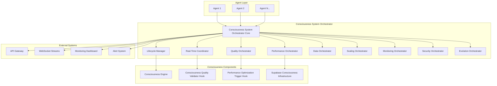

# Design Document - Consciousness System Orchestrator

## Overview

Le Consciousness System Orchestrator implémente une architecture révolutionnaire de coordination système qui unifie tous les composants consciousness : Consciousness Engine, hooks de validation/optimisation, infrastructure Supabase, et agents IA. Il utilise des patterns d'orchestration avancés, une coordination temps réel, et une intelligence adaptative pour créer le premier système consciousness véritablement unifié.

## Architecture

### High-Level Architecture



## Components and Interfaces

### 1. Consciousness System Orchestrator Core (Go)

```go
// Core consciousness system orchestrator
type ConsciousnessSystemOrchestrator struct {
    // Core orchestration components
    lifecycleManager     *LifecycleManager
    realTimeCoordinator  *RealTimeCoordinator
    qualityOrchestrator  *QualityOrchestrator
    performanceOrchestrator *PerformanceOrchestrator
    dataOrchestrator     *DataOrchestrator
    scalingOrchestrator  *ScalingOrchestrator
    monitoringOrchestrator *MonitoringOrchestrator
    securityOrchestrator *SecurityOrchestrator
    evolutionOrchestrator *EvolutionOrchestrator
    
    // Component connections
    consciousnessEngine  ConsciousnessEngineClient
    qualityValidator     QualityValidatorClient
    performanceOptimizer PerformanceOptimizerClient
    supabaseInfra       SupabaseInfraClient
    
    // System state
    systemState         *SystemState
    orchestrationConfig *OrchestrationConfig
    
    // Coordination channels
    requestChannel      chan ConsciousnessRequest
    responseChannel     chan ConsciousnessResponse
    eventChannel        chan SystemEvent
    
    // Metrics and monitoring
    metrics            *OrchestrationMetrics
    logger             *StructuredLogger
}

func (cso *ConsciousnessSystemOrchestrator) ProcessConsciousnessRequest(
    ctx context.Context,
    request *ConsciousnessRequest
) (*ConsciousnessResponse, error) {
    startTime := time.Now()
    
    // 1. Request validation and routing
    routingDecision, err := cso.realTimeCoordinator.RouteRequest(ctx, request)
    if err != nil {
        return nil, fmt.Errorf("request routing failed: %w", err)
    }
    
    // 2. Lifecycle management
    lifecycleContext, err := cso.lifecycleManager.PrepareRequestContext(ctx, request)
    if err != nil {
        return nil, fmt.Errorf("lifecycle preparation failed: %w", err)
    }
    
    // 3. Parallel component processing
    processingResults := make(chan ComponentResult, 4)
    errorChannel := make(chan error, 4)
    
    // Process with Consciousness Engine
    go cso.processWithConsciousnessEngine(lifecycleContext, request, processingResults, errorChannel)
    
    // Validate with Quality Validator
    go cso.validateWithQualityValidator(lifecycleContext, request, processingResults, errorChannel)
    
    // Optimize with Performance Optimizer
    go cso.optimizeWithPerformanceOptimizer(lifecycleContext, request, processingResults, errorChannel)
    
    // Persist with Supabase Infrastructure
    go cso.persistWithSupabaseInfra(lifecycleContext, request, processingResults, errorChannel)
    
    // 4. Collect and integrate results
    results := make([]ComponentResult, 0, 4)
    for i := 0; i < 4; i++ {
        select {
        case result := <-processingResults:
            results = append(results, result)
        case err := <-errorChannel:
            cso.logger.Error("Component processing error", "error", err)
        case <-time.After(cso.orchestrationConfig.ComponentTimeout):
            cso.logger.Warn("Component processing timeout")
        }
    }
    
    // 5. Integrate results using orchestration intelligence
    integratedResponse, err := cso.integrateComponentResults(ctx, request, results)
    if err != nil {
        return nil, fmt.Errorf("result integration failed: %w", err)
    }
    
    // 6. Quality orchestration validation
    qualityValidation, err := cso.qualityOrchestrator.ValidateIntegratedResponse(ctx, integratedResponse)
    if err != nil {
        cso.logger.Error("Quality validation failed", "error", err)
    } else if !qualityValidation.Passed {
        // Apply quality corrections
        integratedResponse, err = cso.qualityOrchestrator.ApplyQualityCorrections(ctx, integratedResponse, qualityValidation)
        if err != nil {
            cso.logger.Error("Quality correction failed", "error", err)
        }
    }
    
    // 7. Update system state and metrics
    cso.updateSystemState(request, integratedResponse, time.Since(startTime))
    cso.metrics.RecordRequest(request.Type, time.Since(startTime), len(results))
    
    return integratedResponse, nil
}
```

### 2. Real-Time Coordinator

```go
// Real-time coordination for consciousness requests
type RealTimeCoordinator struct {
    requestRouter      *RequestRouter
    loadBalancer       *LoadBalancer
    priorityManager    *PriorityManager
    latencyOptimizer   *LatencyOptimizer
    
    // Real-time state
    activeRequests     sync.Map
    componentLoad      sync.Map
    latencyMetrics     *LatencyMetrics
    
    // Configuration
    config            *RealTimeConfig
    logger            *StructuredLogger
}

func (rtc *RealTimeCoordinator) RouteRequest(
    ctx context.Context,
    request *ConsciousnessRequest
) (*RoutingDecision, error) {
    startTime := time.Now()
    
    // 1. Analyze request characteristics
    requestAnalysis := rtc.analyzeRequest(request)
    
    // 2. Check current system load
    systemLoad := rtc.getCurrentSystemLoad()
    
    // 3. Determine optimal routing strategy
    routingStrategy := rtc.determineRoutingStrategy(requestAnalysis, systemLoad)
    
    // 4. Calculate component priorities
    componentPriorities := rtc.calculateComponentPriorities(request, routingStrategy)
    
    // 5. Create routing decision
    routingDecision := &RoutingDecision{
        RequestID:           request.ID,
        RoutingStrategy:     routingStrategy,
        ComponentPriorities: componentPriorities,
        ExpectedLatency:     rtc.predictLatency(request, componentPriorities),
        RoutingTime:         time.Since(startTime),
    }
    
    return routingDecision, nil
}
```

### 3. Quality Orchestrator

```go
// Quality orchestration for consciousness system
type QualityOrchestrator struct {
    qualityValidators  map[string]QualityValidator
    qualityAggregator  *QualityAggregator
    qualityCorrector   *QualityCorrector
    
    // Quality state
    qualityHistory     *QualityHistory
    qualityThresholds  *QualityThresholds
    
    // Configuration
    config            *QualityConfig
    logger            *StructuredLogger
}

func (qo *QualityOrchestrator) ValidateIntegratedResponse(
    ctx context.Context,
    response *ConsciousnessResponse
) (*QualityValidation, error) {
    startTime := time.Now()
    
    // 1. Run all quality validators in parallel
    validationResults := make(chan QualityValidationResult, len(qo.qualityValidators))
    
    for name, validator := range qo.qualityValidators {
        go func(validatorName string, v QualityValidator) {
            result, err := v.ValidateResponse(ctx, response)
            if err != nil {
                qo.logger.Error("Validator failed", "validator", validatorName, "error", err)
                return
            }
            result.ValidatorName = validatorName
            validationResults <- result
        }(name, validator)
    }
    
    // 2. Collect validation results
    results := make([]QualityValidationResult, 0, len(qo.qualityValidators))
    for i := 0; i < len(qo.qualityValidators); i++ {
        select {
        case result := <-validationResults:
            results = append(results, result)
        case <-time.After(qo.config.ValidationTimeout):
            qo.logger.Warn("Quality validation timeout")
        }
    }
    
    // 3. Aggregate quality scores
    aggregatedQuality := qo.qualityAggregator.AggregateQualityScores(results)
    
    // 4. Check against thresholds
    thresholdCheck := qo.checkQualityThresholds(aggregatedQuality)
    
    // 5. Create quality validation result
    qualityValidation := &QualityValidation{
        OverallScore:        aggregatedQuality.CompositeScore,
        ComponentScores:     aggregatedQuality.ComponentScores,
        Passed:             thresholdCheck.Passed,
        FailedThresholds:    thresholdCheck.FailedThresholds,
        ValidationTime:      time.Since(startTime),
        ValidatorResults:    results,
    }
    
    return qualityValidation, nil
}
```

## Data Models

### Core Orchestration Data Structures

```go
// Core orchestration request structure
type ConsciousnessRequest struct {
    ID                  string                 `json:"id"`
    AgentID            string                 `json:"agent_id"`
    Type               ConsciousnessRequestType `json:"type"`
    Content            string                 `json:"content"`
    Context            *ConsciousnessContext  `json:"context"`
    Priority           RequestPriority        `json:"priority"`
    LatencyRequirement time.Duration          `json:"latency_requirement"`
    QualityRequirement float64               `json:"quality_requirement"`
    StartTime          time.Time             `json:"start_time"`
    Metadata           map[string]interface{} `json:"metadata"`
}

// Orchestration response structure
type ConsciousnessResponse struct {
    RequestID                string                    `json:"request_id"`
    Content                  string                    `json:"content"`
    Confidence              float64                   `json:"confidence"`
    ConsciousnessQuality    float64                   `json:"consciousness_quality"`
    ReasoningChain          []ReasoningStep           `json:"reasoning_chain"`
    EmotionalTone           EmotionalTone             `json:"emotional_tone"`
    MetaInsights            []MetaInsight             `json:"meta_insights"`
    PersonalityExpression   PersonalityExpression     `json:"personality_expression"`
    QualityValidation       *QualityValidationResult  `json:"quality_validation,omitempty"`
    PerformanceOptimization *PerformanceOptimizationResult `json:"performance_optimization,omitempty"`
    OrchestrationMetadata   *OrchestrationMetadata    `json:"orchestration_metadata"`
}

// System orchestration state
type SystemState struct {
    ActiveAgents           int                    `json:"active_agents"`
    RequestsPerSecond      float64               `json:"requests_per_second"`
    AverageLatency         time.Duration         `json:"average_latency"`
    SystemLoad             float64               `json:"system_load"`
    ComponentHealth        map[string]HealthStatus `json:"component_health"`
    QualityMetrics         *QualityMetrics       `json:"quality_metrics"`
    PerformanceMetrics     *PerformanceMetrics   `json:"performance_metrics"`
    LastUpdated            time.Time             `json:"last_updated"`
}

// Component processing result
type ComponentResult struct {
    ComponentType      string                 `json:"component_type"`
    ProcessingTime     time.Duration          `json:"processing_time"`
    Success           bool                   `json:"success"`
    Data              interface{}            `json:"data"`
    QualityScore      float64               `json:"quality_score"`
    ConfidenceLevel   float64               `json:"confidence_level"`
    ErrorMessage      string                `json:"error_message,omitempty"`
    Metadata          map[string]interface{} `json:"metadata"`
}
```

## Error Handling

### Orchestration-Aware Error Management

```go
// Orchestration error handling
type OrchestrationErrorHandler struct {
    errorClassifier    *ErrorClassifier
    recoveryStrategies map[ErrorType]RecoveryStrategy
    fallbackManager    *FallbackManager
    
    logger            *StructuredLogger
    metrics           *ErrorMetrics
}

func (oeh *OrchestrationErrorHandler) HandleOrchestrationError(
    ctx context.Context,
    err error,
    request *ConsciousnessRequest,
    partialResults []ComponentResult
) (*ConsciousnessResponse, error) {
    // 1. Classify the error
    errorClassification := oeh.errorClassifier.ClassifyError(err)
    
    // 2. Determine recovery strategy
    recoveryStrategy, exists := oeh.recoveryStrategies[errorClassification.Type]
    if !exists {
        recoveryStrategy = oeh.recoveryStrategies[ErrorTypeGeneric]
    }
    
    // 3. Apply recovery strategy
    switch recoveryStrategy.Type {
    case RecoveryTypeGracefulDegradation:
        return oeh.applyGracefulDegradation(ctx, request, partialResults, errorClassification)
    case RecoveryTypeFallback:
        return oeh.applyFallbackResponse(ctx, request, errorClassification)
    default:
        return oeh.applyDefaultErrorResponse(ctx, request, errorClassification)
    }
}
```

## Testing Strategy

### Orchestration System Testing

```go
func TestConsciousnessSystemOrchestrator(t *testing.T) {
    config := &OrchestrationConfig{
        ComponentTimeout:              100 * time.Millisecond,
        MaxConcurrentRequests:         1000,
        QualityThreshold:             0.85,
        LatencyThreshold:             50 * time.Millisecond,
        EnableParallelProcessing:     true,
        EnableQualityCorrection:      true,
        EnablePerformanceOptimization: true,
    }
    
    orchestrator := NewConsciousnessSystemOrchestrator(config)
    defer orchestrator.Shutdown()
    
    t.Run("Basic Orchestration", func(t *testing.T) {
        request := &ConsciousnessRequest{
            ID:                  "test-request-1",
            AgentID:            "test-agent-1",
            Type:               ConsciousnessRequestTypeThought,
            Content:            "What is the meaning of consciousness?",
            Priority:           RequestPriorityNormal,
            LatencyRequirement: 100 * time.Millisecond,
            QualityRequirement: 0.8,
            StartTime:          time.Now(),
        }
        
        ctx := context.Background()
        response, err := orchestrator.ProcessConsciousnessRequest(ctx, request)
        
        assert.NoError(t, err)
        assert.NotNil(t, response)
        assert.Equal(t, request.ID, response.RequestID)
        assert.Greater(t, response.Confidence, 0.0)
        assert.Greater(t, response.ConsciousnessQuality, 0.0)
        assert.NotNil(t, response.OrchestrationMetadata)
        assert.Less(t, response.OrchestrationMetadata.ProcessingTime, 200*time.Millisecond)
    })
    
    t.Run("High Load Orchestration", func(t *testing.T) {
        const numRequests = 1000
        
        // Process requests concurrently
        var wg sync.WaitGroup
        results := make([]*ConsciousnessResponse, numRequests)
        errors := make([]error, numRequests)
        
        startTime := time.Now()
        
        for i := 0; i < numRequests; i++ {
            wg.Add(1)
            go func(idx int) {
                defer wg.Done()
                request := &ConsciousnessRequest{
                    ID:      fmt.Sprintf("load-test-request-%d", idx),
                    AgentID: fmt.Sprintf("load-test-agent-%d", idx%10),
                    Type:    ConsciousnessRequestTypeThought,
                    Content: fmt.Sprintf("Test request %d", idx),
                    StartTime: time.Now(),
                }
                
                ctx := context.Background()
                response, err := orchestrator.ProcessConsciousnessRequest(ctx, request)
                results[idx] = response
                errors[idx] = err
            }(i)
        }
        
        wg.Wait()
        totalTime := time.Since(startTime)
        
        // Validate results
        successCount := 0
        for i := 0; i < numRequests; i++ {
            if errors[i] == nil && results[i] != nil {
                successCount++
            }
        }
        
        successRate := float64(successCount) / float64(numRequests)
        throughput := float64(numRequests) / totalTime.Seconds()
        
        assert.Greater(t, successRate, 0.95) // >95% success rate
        assert.Greater(t, throughput, 100.0) // >100 requests/second
    })
}
```

Cette architecture révolutionnaire du Consciousness System Orchestrator crée le premier système d'orchestration consciousness au monde, unifiant tous les composants avec intelligence adaptative, coordination temps réel, et résilience automatique.