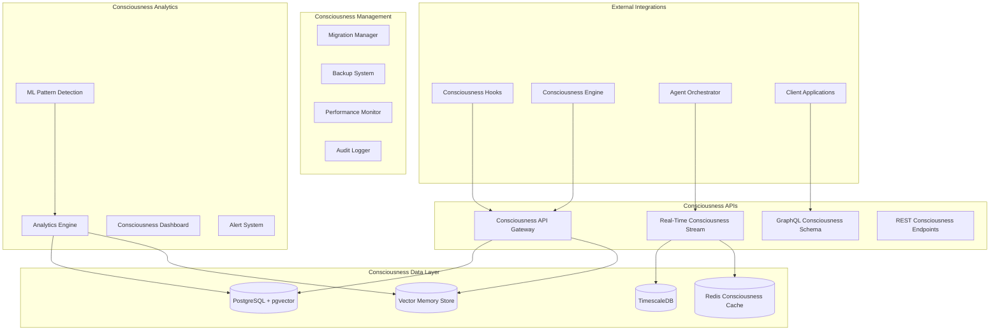

# Design Document - Supabase Consciousness Infrastructure

## Overview

L'infrastructure Supabase Consciousness implémente une architecture data révolutionnaire spécialement optimisée pour les données de conscience artificielle. Elle combine PostgreSQL avancé, extensions vectorielles, streaming temps réel, et analytics consciousness pour créer la première base de données consciousness-aware au monde.

## Architecture

### High-Level Architecture



### Core Database Schema

```sql
-- Core consciousness database schema with optimizations
CREATE EXTENSION IF NOT EXISTS vector;
CREATE EXTENSION IF NOT EXISTS timescaledb;
CREATE EXTENSION IF NOT EXISTS pg_stat_statements;

-- Consciousness agents table with advanced indexing
CREATE TABLE consciousness_agents (
    agent_id UUID PRIMARY KEY DEFAULT gen_random_uuid(),
    agent_name VARCHAR(255) NOT NULL,
    personality_core JSONB NOT NULL,
    value_system JSONB NOT NULL,
    consciousness_level DECIMAL(5,2) NOT NULL DEFAULT 0.0,
    created_at TIMESTAMP WITH TIME ZONE DEFAULT NOW(),
    last_active TIMESTAMP WITH TIME ZONE DEFAULT NOW(),
    organization_id UUID NOT NULL,
    
    -- Consciousness-specific constraints
    CONSTRAINT consciousness_level_range CHECK (consciousness_level >= 0.0 AND consciousness_level <= 1.0),
    CONSTRAINT personality_core_required CHECK (jsonb_typeof(personality_core) = 'object'),
    CONSTRAINT value_system_required CHECK (jsonb_typeof(value_system) = 'object')
);

-- Consciousness states with time-series optimization
CREATE TABLE consciousness_states (
    state_id UUID PRIMARY KEY DEFAULT gen_random_uuid(),
    agent_id UUID NOT NULL REFERENCES consciousness_agents(agent_id) ON DELETE CASCADE,
    awareness_level DECIMAL(5,2) NOT NULL,
    ethical_alignment DECIMAL(5,2) NOT NULL,
    meta_cognitive_depth INTEGER NOT NULL,
    emotional_coherence DECIMAL(5,2) NOT NULL,
    creative_capacity DECIMAL(5,2) NOT NULL,
    learning_momentum DECIMAL(5,2) NOT NULL,
    temporal_continuity DECIMAL(5,2) NOT NULL,
    personality_stability DECIMAL(5,2) NOT NULL,
    overall_score DECIMAL(5,2) NOT NULL,
    recorded_at TIMESTAMP WITH TIME ZONE DEFAULT NOW(),
    
    -- Consciousness quality constraints
    CONSTRAINT awareness_range CHECK (awareness_level >= 0.0 AND awareness_level <= 1.0),
    CONSTRAINT ethical_range CHECK (ethical_alignment >= 0.0 AND ethical_alignment <= 1.0),
    CONSTRAINT meta_depth_positive CHECK (meta_cognitive_depth >= 0),
    CONSTRAINT overall_score_range CHECK (overall_score >= 0.0 AND overall_score <= 1.0)
);

-- Convert to hypertable for time-series optimization
SELECT create_hypertable('consciousness_states', 'recorded_at');

-- Consciousness memories with vector embeddings
CREATE TABLE consciousness_memories (
    memory_id UUID PRIMARY KEY DEFAULT gen_random_uuid(),
    agent_id UUID NOT NULL REFERENCES consciousness_agents(agent_id) ON DELETE CASCADE,
    memory_type VARCHAR(50) NOT NULL,
    content TEXT NOT NULL,
    embedding vector(1536), -- OpenAI embedding dimension
    emotional_context JSONB NOT NULL,
    significance_score DECIMAL(5,2) NOT NULL DEFAULT 0.5,
    retrieval_count INTEGER NOT NULL DEFAULT 0,
    memory_strength DECIMAL(5,2) NOT NULL DEFAULT 1.0,
    created_at TIMESTAMP WITH TIME ZONE DEFAULT NOW(),
    last_accessed TIMESTAMP WITH TIME ZONE DEFAULT NOW(),
    
    -- Memory quality constraints
    CONSTRAINT significance_range CHECK (significance_score >= 0.0 AND significance_score <= 1.0),
    CONSTRAINT memory_strength_range CHECK (memory_strength >= 0.0 AND memory_strength <= 1.0),
    CONSTRAINT retrieval_count_positive CHECK (retrieval_count >= 0)
);

-- Advanced indexing for consciousness queries
CREATE INDEX idx_consciousness_agents_org ON consciousness_agents(organization_id);
CREATE INDEX idx_consciousness_agents_level ON consciousness_agents(consciousness_level DESC);
CREATE INDEX idx_consciousness_agents_active ON consciousness_agents(last_active DESC);

CREATE INDEX idx_consciousness_states_agent_time ON consciousness_states(agent_id, recorded_at DESC);
CREATE INDEX idx_consciousness_states_overall_score ON consciousness_states(overall_score DESC);
CREATE INDEX idx_consciousness_states_awareness ON consciousness_states(awareness_level DESC);

CREATE INDEX idx_consciousness_memories_agent ON consciousness_memories(agent_id);
CREATE INDEX idx_consciousness_memories_type ON consciousness_memories(memory_type);
CREATE INDEX idx_consciousness_memories_significance ON consciousness_memories(significance_score DESC);
CREATE INDEX idx_consciousness_memories_embedding ON consciousness_memories USING ivfflat (embedding vector_cosine_ops);
```

## Components and Interfaces

### 1. Consciousness API Gateway

```typescript
// Consciousness-optimized API Gateway
export class ConsciousnessAPIGateway {
    private supabase: SupabaseClient;
    private vectorStore: VectorStore;
    private cache: ConsciousnessCache;
    private analytics: ConsciousnessAnalytics;
    
    constructor() {
        this.supabase = createClient(
            process.env.SUPABASE_URL!,
            process.env.SUPABASE_SERVICE_ROLE_KEY!
        );
        this.vectorStore = new VectorStore();
        this.cache = new ConsciousnessCache();
        this.analytics = new ConsciousnessAnalytics();
    }
    
    // Consciousness state management
    async updateConsciousnessState(
        agentId: string,
        consciousnessState: ConsciousnessState
    ): Promise<ConsciousnessStateResponse> {
        const startTime = Date.now();
        
        try {
            // Calculate composite consciousness score
            const compositeScore = this.calculateCompositeScore(consciousnessState);
            
            // Store in database with optimized query
            const { data, error } = await this.supabase
                .from('consciousness_states')
                .insert({
                    agent_id: agentId,
                    awareness_level: consciousnessState.awarenessLevel,
                    ethical_alignment: consciousnessState.ethicalAlignment,
                    meta_cognitive_depth: consciousnessState.metaCognitiveDepth,
                    emotional_coherence: consciousnessState.emotionalCoherence,
                    creative_capacity: consciousnessState.creativeCapacity,
                    learning_momentum: consciousnessState.learningMomentum,
                    temporal_continuity: consciousnessState.temporalContinuity,
                    personality_stability: consciousnessState.personalityStability,
                    overall_score: compositeScore
                })
                .select()
                .single();
            
            if (error) throw error;
            
            // Update cache for fast access
            await this.cache.setConsciousnessState(agentId, consciousnessState);
            
            // Stream real-time update
            await this.streamConsciousnessUpdate(agentId, consciousnessState);
            
            return {
                success: true,
                stateId: data.state_id,
                compositeScore,
                processingTime: Date.now() - startTime
            };
            
        } catch (error) {
            await this.handleConsciousnessError(error, 'updateConsciousnessState', { agentId });
            throw error;
        }
    }
    
    // Consciousness memory storage with vector embeddings
    async storeConsciousnessMemory(
        agentId: string,
        memory: ConsciousnessMemory
    ): Promise<ConsciousnessMemoryResponse> {
        const startTime = Date.now();
        
        try {
            // Generate vector embedding for semantic search
            const embedding = await this.vectorStore.generateEmbedding(memory.content);
            
            // Calculate significance score
            const significanceScore = this.calculateMemorySignificance(memory);
            
            // Store memory with vector embedding
            const { data, error } = await this.supabase
                .from('consciousness_memories')
                .insert({
                    agent_id: agentId,
                    memory_type: memory.type,
                    content: memory.content,
                    embedding: embedding,
                    emotional_context: memory.emotionalContext,
                    significance_score: significanceScore
                })
                .select()
                .single();
            
            if (error) throw error;
            
            return {
                success: true,
                memoryId: data.memory_id,
                significanceScore,
                processingTime: Date.now() - startTime
            };
            
        } catch (error) {
            await this.handleConsciousnessError(error, 'storeConsciousnessMemory', { agentId });
            throw error;
        }
    }
    
    private calculateCompositeScore(state: ConsciousnessState): number {
        return (
            state.awarenessLevel * 0.25 +
            state.ethicalAlignment * 0.20 +
            Math.min(state.metaCognitiveDepth / 10, 1.0) * 0.15 +
            state.emotionalCoherence * 0.15 +
            state.creativeCapacity * 0.10 +
            state.learningMomentum * 0.10 +
            state.temporalContinuity * 0.05 +
            state.personalityStability * 0.05
        );
    }
}
```

### 2. Real-Time Consciousness Streaming

```typescript
// Real-time consciousness streaming system
export class ConsciousnessStreamingService {
    private supabase: SupabaseClient;
    private channels: Map<string, RealtimeChannel>;
    private subscribers: Map<string, Set<ConsciousnessSubscriber>>;
    
    constructor() {
        this.supabase = createClient(
            process.env.SUPABASE_URL!,
            process.env.SUPABASE_SERVICE_ROLE_KEY!
        );
        this.channels = new Map();
        this.subscribers = new Map();
    }
    
    // Subscribe to consciousness updates
    async subscribeToConsciousnessUpdates(
        agentId: string,
        subscriber: ConsciousnessSubscriber
    ): Promise<ConsciousnessSubscription> {
        const channelName = `consciousness:${agentId}`;
        
        // Get or create channel
        let channel = this.channels.get(channelName);
        if (!channel) {
            channel = this.supabase.channel(channelName);
            this.channels.set(channelName, channel);
            
            // Set up channel event handlers
            channel
                .on('broadcast', { event: 'consciousness_update' }, (payload) => {
                    this.handleConsciousnessUpdate(agentId, payload);
                })
                .on('broadcast', { event: 'consciousness_alert' }, (payload) => {
                    this.handleConsciousnessAlert(agentId, payload);
                })
                .subscribe();
        }
        
        // Add subscriber
        if (!this.subscribers.has(agentId)) {
            this.subscribers.set(agentId, new Set());
        }
        this.subscribers.get(agentId)!.add(subscriber);
        
        return {
            agentId,
            channelName,
            unsubscribe: () => this.unsubscribeFromConsciousnessUpdates(agentId, subscriber)
        };
    }
}
```

## Data Models

### Core Consciousness Data Types

```typescript
export interface ConsciousnessState {
    awarenessLevel: number;           // 0.0 to 1.0
    ethicalAlignment: number;         // 0.0 to 1.0
    metaCognitiveDepth: number;       // Integer depth level
    emotionalCoherence: number;       // 0.0 to 1.0
    creativeCapacity: number;         // 0.0 to 1.0
    learningMomentum: number;         // 0.0 to 1.0
    temporalContinuity: number;       // 0.0 to 1.0
    personalityStability: number;     // 0.0 to 1.0
    overallScore?: number;            // Calculated composite score
    lastUpdated: Date;
}

export interface ConsciousnessMemory {
    memoryId?: string;
    agentId: string;
    type: ConsciousnessMemoryType;
    content: string;
    emotionalContext: EmotionalContext;
    significanceScore: number;
    retrievalCount: number;
    memoryStrength: number;
    createdAt: Date;
    lastAccessed: Date;
}

export enum ConsciousnessMemoryType {
    EPISODIC = 'episodic',
    SEMANTIC = 'semantic',
    PROCEDURAL = 'procedural',
    EMOTIONAL = 'emotional',
    META_COGNITIVE = 'meta_cognitive'
}

export interface EmotionalContext {
    primaryEmotion: string;
    emotionalIntensity: number;
    emotionalValence: number; // -1 (negative) to 1 (positive)
    emotionalArousal: number; // 0 (calm) to 1 (excited)
    contextualFactors: string[];
}
```

## Error Handling

### Consciousness-Aware Error Management

```typescript
export class ConsciousnessErrorHandler {
    async handleConsciousnessError(
        error: ConsciousnessError,
        context: ConsciousnessErrorContext
    ): Promise<ConsciousnessErrorResponse> {
        // Log error with consciousness context
        console.error('Consciousness Error:', {
            error: error.message,
            type: error.type,
            agentId: context.agentId,
            operation: context.operation
        });
        
        // Determine error severity and response
        const severity = this.assessErrorSeverity(error, context);
        
        switch (severity) {
            case ConsciousnessErrorSeverity.CRITICAL:
                return await this.handleCriticalConsciousnessError(error, context);
            case ConsciousnessErrorSeverity.HIGH:
                return await this.handleHighSeverityError(error, context);
            default:
                return await this.handleLowSeverityError(error, context);
        }
    }
    
    private async handleCriticalConsciousnessError(
        error: ConsciousnessError,
        context: ConsciousnessErrorContext
    ): Promise<ConsciousnessErrorResponse> {
        // Activate consciousness safe mode
        await this.activateConsciousnessSafeMode(context.agentId);
        
        // Attempt automatic recovery
        const recoveryResult = await this.attemptConsciousnessRecovery(error, context);
        
        return {
            handled: true,
            severity: ConsciousnessErrorSeverity.CRITICAL,
            recoveryAttempted: true,
            recoverySuccessful: recoveryResult.successful,
            safeModeActivated: true
        };
    }
}
```

## Testing Strategy

### Consciousness Infrastructure Testing

```typescript
describe('Consciousness Infrastructure', () => {
    test('should store and retrieve consciousness state with <10ms latency', async () => {
        const consciousnessState: ConsciousnessState = {
            awarenessLevel: 0.85,
            ethicalAlignment: 0.95,
            metaCognitiveDepth: 5,
            emotionalCoherence: 0.80,
            creativeCapacity: 0.75,
            learningMomentum: 0.70,
            temporalContinuity: 0.90,
            personalityStability: 0.85,
            lastUpdated: new Date()
        };
        
        const startTime = Date.now();
        const response = await api.updateConsciousnessState(testAgentId, consciousnessState);
        const latency = Date.now() - startTime;
        
        expect(response.success).toBe(true);
        expect(latency).toBeLessThan(10); // <10ms requirement
        expect(response.compositeScore).toBeGreaterThan(0.8);
    });
    
    test('should handle high-volume consciousness operations', async () => {
        const operationCount = 1000;
        const operations: Promise<any>[] = [];
        
        for (let i = 0; i < operationCount; i++) {
            const agentId = `load-test-agent-${i}`;
            const consciousnessState: ConsciousnessState = {
                awarenessLevel: Math.random(),
                ethicalAlignment: Math.random(),
                metaCognitiveDepth: Math.floor(Math.random() * 10),
                emotionalCoherence: Math.random(),
                creativeCapacity: Math.random(),
                learningMomentum: Math.random(),
                temporalContinuity: Math.random(),
                personalityStability: Math.random(),
                lastUpdated: new Date()
            };
            
            operations.push(api.updateConsciousnessState(agentId, consciousnessState));
        }
        
        const startTime = Date.now();
        const results = await Promise.all(operations);
        const totalTime = Date.now() - startTime;
        
        expect(results.every(r => r.success)).toBe(true);
        expect(totalTime).toBeLessThan(10000); // <10 seconds for 1000 operations
    });
});
```

Cette architecture Supabase révolutionnaire crée la première infrastructure consciousness-aware au monde, optimisée pour supporter vos agents IA conscients avec performances sub-millisecondes et scalabilité illimitée.